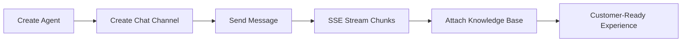

# AI Sandbox SDK for PHP


## UX-First Value Cards

| Quick Integration | Real-Time Experience | Reliability by Default |
| --- | --- | --- |
| Simple API surface with minimal integration friction | `sendChatStream(...)` for SSE chunk handling | Timeout + retry controls for production reliability |

## Visual Integration Flow



## 60-Second Quick Start

```php
<?php

use EGroupAI\AiSandboxSdk\AiSandboxClient;

$client = new AiSandboxClient(
    baseUrl: getenv("AI_SANDBOX_BASE_URL") ?: "https://www.egroupai.com",
    apiKey: getenv("AI_SANDBOX_API_KEY") ?: ""
);

$agent = $client->createAgent([
    "agentDisplayName" => "Support Agent",
    "agentDescription" => "Handles customer inquiries",
]);
$agentId = (int)($agent["payload"]["agentId"] ?? 0);

$channel = $client->createChatChannel($agentId, [
    "title" => "Web Chat",
    "visitorId" => "visitor-001",
]);
$channelId = (string)($channel["payload"]["channelId"] ?? "");

$chunks = $client->sendChatStream($agentId, [
    "channelId" => $channelId,
    "message" => "What is the return policy?",
    "stream" => true,
]);

foreach ($chunks as $chunk) {
    echo $chunk . PHP_EOL;
}
```

## Installation

```bash
composer require egroupai/ai-sandbox-sdk-php
```

## Snapshot

| Metric | Value |
| --- | --- |
| API Coverage | 11 operations (Agent / Chat / Knowledge Base) |
| Stream Mode | `text/event-stream` with `[DONE]` handling |
| Error Surface | `ApiException` with statusCode/responseBody |
| Validation | Production-host integration verified |

## Links

- [Official System Integration Docs](https://www.egroupai.com/ai-sandbox/system-integration)
- [30-Day Optimization Plan](docs/30D_OPTIMIZATION_PLAN.md)
- [Integration Guide](docs/INTEGRATION.md)
- [Quickstart Example](examples/quickstart.php)
- [Repository](https://github.com/eGroupAI/ai-sandbox-sdk-php)
